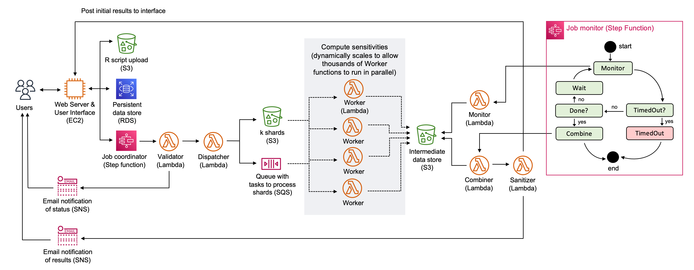
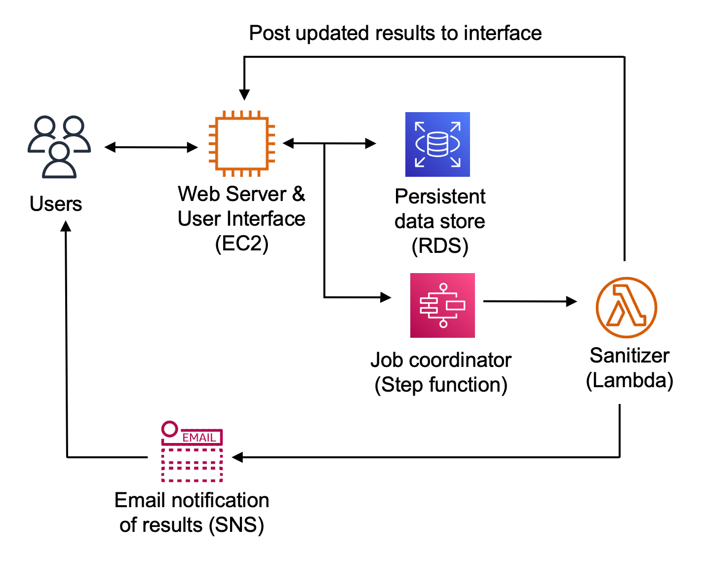

# Validation Server (Version 2.0) - Backend 

This repository contains the backend application code for the Urban Institute's [Safe Data Technologies](https://www.urban.org/projects/safe-data-technologies) Validation Server Version 2.0 prototype. The repository uses the [Serverless Application Model (SAM)](https://aws.amazon.com/serverless/sam/) to define and manage AWS resources. 

## Quick Links
- [Technical White Paper](https://www.urban.org/research/publication/privacy-preserving-validation-server-version-2) 
- [Staging URL](https://sdt-validation-server.urban.org) 

## Related Repositories

- [validation-server-v2-api](https://github.com/UrbanInstitute/validation-server-v2-api): Django REST API for the validation server version 2.0 prototype
- [validation-server-v2-frontend](https://github.com/UrbanInstitute/validation-server-v2-frontend): Frontend for the validation server version 2.0 prototype
- [validation-server-v2-infrastructure](https://github.com/UrbanInstitute/validation-server-v2-infrastructure): CloudFormation stack for the API and frontend infrastructure of the validation server version 2.0 prototype
- [validation-server-v2-r-package](https://github.com/UrbanInstitute/validation-server-v2-r-package): User-facing R package for the validation server version 2.0 prototype

## Repository Structure 
- `functions/`: Code for the application's Lambda functions
- `statemachines/`: Definition for the application's state machine
- `invoke/`: Syntax to invoke new jobs and runs 
- `samconfig.toml`: Configuration file for manual SAM deployments 
- `template.yaml`: SAM template that defines the application's AWS resources 
- `.github/workflows/`: GitHub Actions workflows for CI/CD 

## Deployment  
**Note**: CI/CD is removed from the public version of the code in this repository. The instructions below describe how CI/CD is managed in the codebase under active development. Please contact us if you are interested in setting up CI/CD for your own deployment and have questions. 

CI/CD is set up through GitHub Actions. Updates to the `staging` and `production` branches in this repository will trigger a GitHub Actions workflow to deploy the updates to the relevant resources on AWS. The AWS resources are managed through separate staging and production CloudFormation stacks to define and manage infrastructure as code. All of the relevant backend resources have `-stg` or `-prod` suffixes to distinguish them.

To deploy a `-dev` version of the application manually (assuming you have the AWS CLI and SAM CLI installed and configured), run the following from the command line: 
```
sam build
sam deploy 
```

## Architecture 
The application is managed through a state machine that orchestrates the various Lambda functions when a new job is submitted. The Lambda functions use a container image (defined in `functions/Dockerfile`) with R installed to run the user-submitted code using `rpy2`. Job configurations (e.g. the number of subsets, the default epsilon value for a job, etc.) are defined in `functions/config.py`. 



When a new job is submitted, the state machine is invoked. When a new run (updated epsilon values) for an existing job is submitted, the sanitizer function is invoked directly. 



## Other

### Troubleshooting 
* Check the logs in the step function execution. 
* Check the logs in the GitHub Actions workflow or CloudFormation stack. 
* Check for updates or patches to the API codebase or the server hosting the API and frontend.  

### Upload to the Encrypted S3 Bucket
Assuming you have the necessary AWS permissions: 

```
aws s3 cp <local-file> s3://sdt-validation-server-dev/data/<s3-file> --sse=aws:kms
```

## Contact
This work is developed by the Urban Institute. For questions, reach out to: validationserver@urban.org. 